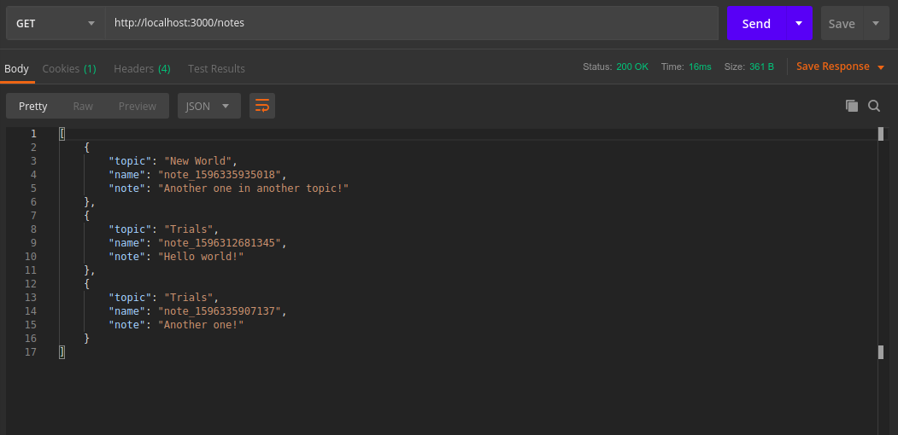
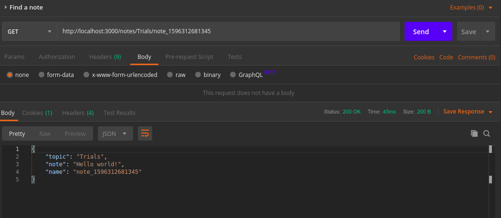
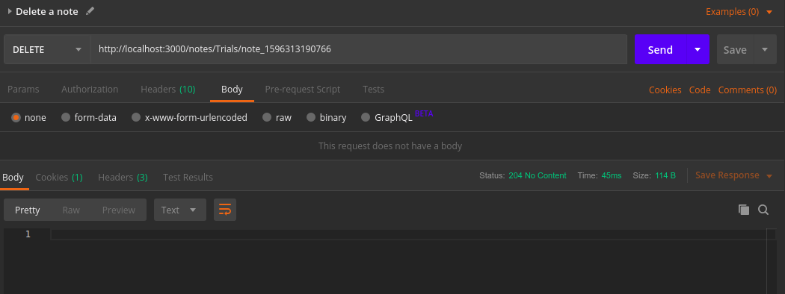

# node-wejapa-note-app

### All notes

### Add a note

### Find a note

- Add topic and fileName to the url ie. /notes/{topic}/{fileName}

### Update a note

- Add topic and fileName to the url ie. /notes/{topic}/{fileName}

### Delete a note

- Add topic and fileName to the url ie. /notes/{topic}/{fileName}

